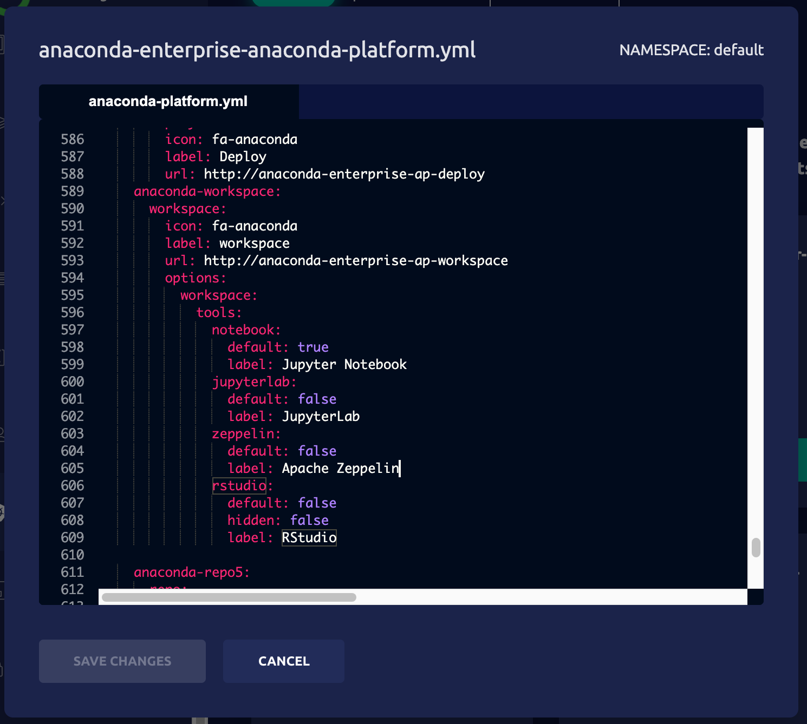
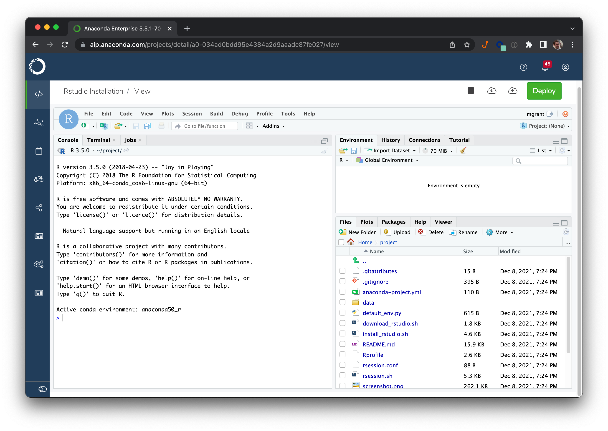

# Adding RStudio support to AE5.5.1+

> **NOTE**: there is an [operating-system issue](https://bugzilla.redhat.com/show_bug.cgi?id=1909037) 
> that prevents some R environments from working with RStudio.
> This has been corrected in AE5.5.2. For AE5.5.1, there is a
> simple workaround: add the conda package `openldap=2.4` to
> the environment in question (and, if appropriate, your 
> `anaconda-project.yml` specification) *before* switching
> to the RStudio editor.

This repository allows AE5 customers to install
[RStudio](https://www.rstudio.com/) and use it within AE5.
In order to fully respect RStudio's licensing terms, Anaconda
cannot provide the RStudio binaries to customers—they must
acquire it themselves.

These instructions are intended to be followed by the customer
and can be applied to AE 5.5.1 or later. Installation introduces
minimal disruption to the cluster, and can easily be reverted if
issues arise. The Anaconda team is happy to assist if necessary.

Auxiliary tools such as RStudio, VSCode, or Zeppelin are installed
into a shared volume provisioned just for this purpose. If RStudio
is the first tool being installed, those instructions will need
to be followed first. See the document [TOOLS.md](TOOLS.md) for
more details, and make sure that work is completed before
proceeding with the instructions here.

The latest approved versions of the RStudio support files can
always be found at these links.

- This file, in PDF form: [rstudio-install.pdf](http://airgap.svc.anaconda.com.s3.amazonaws.com/misc/rstudio-install.pdf)
- Tools volume documentation: [tools-volume.pdf](http://airgap.svc.anaconda.com.s3.amazonaws.com/misc/tools-volume.pdf)
- Installer project: [rstudio-installer.tar.bz2](http://airgap.svc.anaconda.com.s3.amazonaws.com/misc/rstudio-installer.tar.bz2)

## Installation

We have broken the installation process into the following steps:

1. _Set the tool volume to read-write._ **(5.5.1 only)**
2. _Launch the RStudio installation project._
3. _Obtain the RStudio server binaries._
4. _Run the installation script._
5. _Enable the RStudio editor option._
6. _Verify the installation._
7. _Set the tool volume to read-only._ **(5.5.1 only)**

The steps will have the following impact on the behavior of the cluster:

- No *existing* sessions or deployments will be affected. Users
  can continue to work in existing sessions without interruption.
- During Steps 1, 5, and 7, there will be brief (<30 second)
  interruptions in the function of main UI.
- While Steps 2 through 6 are in progress, the `/tools` volume
  will be mounted into any new sessions, deployments, and jobs
  in a read-write fashion.
  
Overall, we recommend executing these steps during a maintenance
interval, during which users should not create new sessions. But
you do not need to ask your users to halt existing sessions
or deployments.

***NOTE:*** if you are performing this work on AE 5.5.2 or later,
the steps have been simplified. Look for annotations marked
*"5.5.1"* or *"5.5.2+"* for steps that are specific to each version.

### Step 1. Set the tool volume to read-write (5.5.1)

***5.5.2+:*** skip this step and proceed directly to step 2.

1. Edit the `anaconda-platform.yml` ConfigMap. On Gravity clusters,
   this is most easily performed in the Ops Center.
2. Search for the `/tools:` volume specification.
3. Change `readOnly: true` to `readOnly: false`.
4. Save the changed ConfigMap. If possible, *leave the editor open*;
   you will be making more changes here in Step 5 and Step 7. 
5. Open a terminal window with `kubectl` access to the cluster,
   and restart the workspace pod:

   ```
   kubectl get pods | grep ap-workspace | cut -d ' ' -f 1 | xargs kubectl delete pod
   ```

6. Monitor the new workspace pod using `kubectl get pods` and
   wait for it to stabilize. *Leave this terminal window open
   as well*, as you will use it in Step 5 and Step 7.
   
### Step 2. Launch the RStudio installer project

As mentioned above, installation will proceed from within a standard
AE5 session. So to begin the process, we complete the following steps:

1. ***5.5.2+:*** log into AE5 as the 
   storage manager user, typically `anaconda-enterprise`.
   This is the user that is given read-write access to the
   `/tools` volume.
2. Download the project and save it to the machine
   from which you are accessing AE5. A link is provided
   in the top section of this document.
3. In a new browser window, log into AE5, and use the
   "Create+ / Upload Project" dialog to upload the RStudio
   Installation project archive that has been provided to you.
4. We recommend using the JupyterLab editor for this project. To
   change this, click on the project's name to be taken to the settings
   page, change the Default Editor, and Save.
5. Launch a session for this project.

### Step 3. Obtain the RStudio Server binaries

The files we need to install RStudio are RPM files hosted on the site
`download2.rstudio.org`, and these must be pulled into the project session.
Below are three different methods for accomplishing this.

#### Downloading RStudio directly from AE5

If your cluster has a direct connection to the internet, this is
definitely the best approach.

1. Launch a terminal window in the session created in Step 2.
2. If you need to set proxy variables manually in order to
   access the internet, do so now.
3. Run the command `bash download_rstudio.sh`

If the script completes successfully, you will have the binaries
you need to proceed to step 4. The output of the script will
look something like this:

```
+------------------------+
| AE5 RStudio Downloader |
+------------------------+
- Target version: 2021.09.1-372
- Downloading into the data directory
- Downloading RHEL8/CentOS8 RPM file to data/rs-centos8.rpm
- URL: https://download2.rstudio.org/server/centos8/x86_64/rstudio-server-rhel-2021.09.1-372-x86_64.rpm
  % Total    % Received % Xferd  Average Speed   Time    Time     Time  Current
                                 Dload  Upload   Total   Spent    Left  Speed
100 58.3M  100 58.3M    0     0   250M      0 --:--:-- --:--:-- --:--:--  249M
- Verifying data/rs-centos8.rpm
- Downloading RHEL7/CentOS7 RPM file to data/rs-centos7.rpm
- URL: https://download2.rstudio.org/server/centos7/x86_64/rstudio-server-rhel-2021.09.1-372-x86_64.rpm
  % Total    % Received % Xferd  Average Speed   Time    Time     Time  Current
                                 Dload  Upload   Total   Spent    Left  Speed
100 58.3M  100 58.3M    0     0   193M      0 --:--:-- --:--:-- --:--:--  193M
- Verifying data/rs-centos7.rpm
+------------------------+
The RStudio binaries have been downloaded.
You may now proceed with the installation step.
See the README.md file for more details.
+------------------------+
```

#### Using the download script on another Unix server

If you need to download the binaries on a separate machine first,
the `download_rstudio.sh` script can simplify this process.

1. Download the script `download_rstudio.sh` from the project
   to your desktop.
2. Move this script to a machine capable of running
   `bash` and `curl` with connectivity to `download2.rstudio.org`.
3. Run the command `bash download_rstudio.sh`
4. If necessary, transfer the binaries `rs-centos8.rpm` and
   `rs-centos8.rpm` to the machine from which you access AE5.
5. Use the JuptyerLab upload button to upload both binaries
   into the RStudio installer project.
  
#### Manually obtaining the files

If it is not possible for you to use the `download_rstudio.sh`
script, you can obtain the files manually. Note that the
installation process requires two different RPM files that
have identical filenames. For this reason, we require that
each file is renamed after downloading, as described here.

1. Download the CentOS 8 RPM:

   ```
   https://download2.rstudio.org/server/centos8/x86_64/rstudio-server-rhel-2021.09.0-351-x86_64.rpm
   ```

2. Rename this file `rs-centos8.rpm`.
3. Download the CentOS 7 RPM:

   ```
   https://download2.rstudio.org/server/centos7/x86_64/rstudio-server-rhel-2021.09.0-351-x86_64.rpm
   ```

4. Rename this file `rs-centos7.rpm`.
5. If necessary, transfer both files to the machine from
   which you are accessing AE5.
6. Use the JuptyerLab upload button to upload both binaries
   into the RStudio installer project.
   
### Step 4. Run the installation script

Once the files `rs-centos7.rpm` and `rs-centos8.rpm` are in place,
the actual installation can proceed.

1. Launch a terminal window, or return to an existing one.
2. If you have previously installed content into `/tools/rstudio`,
   remove it now. The script will not proceed if there is any
   content in that directory. For simplicity, you can remove
   the entire directory; e.g., `rm -r /tools/rstudio`.
3. Run the command `bash install_rstudio.sh`. Before performing
   any modifications, the script verifies that all of its
   prerequisites are met.
4. Perform a basic verification of installation by running the script
   `/tools/rstudio/start_rsession.sh`.
   _This should exit with an error_, specifically an “Address already
   in use” error of some sort. The key is to verify that this error
   actually came from RStudio itself, which confirms that the
   application is visible to Anaconda Enterprise.

The output of the installer script should look like this:

```
+-----------------------+
| AE5 RStudio Installer |
+-----------------------+
- Install prefix: /tools/rstudio
- Verifying data/rs-centos8.rpm
- Verifying data/rs-centos7.rpm
- Creating directory /tools/rstudio
- Staging full RHEL8/CentOS8 package
1069677 blocks
- Staging RHEL7/CentOS7 rsession binary
1069390 blocks
- Moving files into final position
- Installing support files
+-----------------------+
RStudio installation is complete.
Once you have verified the installation, feel free to
shut down this session and delete the project.
+-----------------------+
```

### Step 5. Enable the RStudio editor option

The next step is to add RStudio to the editor selection list presented
by the UI.

1. Return to the ConfigMap editor you used in Step 1.
2. Search for the `rstudio:` section of this file. The
   quickest way to do so is to focus the text editor and search for the
   text `rstudio:` (including the colon). The default values
   in this section will look like this:

   ```
             rstudio:
               default: false
               hidden: true
               label: RStudio
   ```
   Change the value `hidden: true` to `hidden: false`.
3. Once you have verified the correct formatting, click the "Save
   Changes" button.
4. In your `kubectl` terminal window, restart the UI pod.
   This pod should take less than a minute to refresh.

   ```
   kubectl get pods | grep 'ap-ui-' | cut -d' ' -f1 | xargs kubectl delete pods
   ```

There may be minor disruptions in UI responsiveness during this time.
If you have allowed users to continue working during this time, they
may need to refresh their browsers, although this should
not be necessary for views of running sessions or deployments. Once
the UI pod stabilizes, in less than a minute, the RStudio editor
will be present in the Default Editor drop-down on the
project settings page.

To help clarify the desired result in this step, we have attached below
a screenshot of the Op Center for a typical cluster immediately after
Step 5 is completed.



### Step 6. Verify the installation

1. Stop the session for your RStudio installer project.
2. Go to the project Settings page.
3. Select RStudio in the Default Editor dropdown, and click Save.
4. Start a new session and wait for the editor to launch.

Attached below is a screenshot of the RStudio editor upon launch.



If for some reason, you experience issues with this:

1. Click on the "Logs" tab.
2. Examine the full `editor` logs. Look in particular for a section
   titled `AE5 R Session Manager`, and look for errors there and below.
3. Copy the full content of this log so it can be shared with Anaconda.
4. Stop the session completely.
5. Go to the project's Settings page, and change the Default
   Editor back to JupyterLab.
6. If any obvious corrective action is called for, launch a new
   session to make those changes.

Please feel free to reach out to Anaconda support if this occurs.
Make sure to include a copy of the editor logs you obtained above.

### Step 7. Set the tool volume to read-only (5.5.1)

***5.5.2+:*** skip this step completely.

1. Return to the ConfigMap editor.
2. Search for the `/tools:` volume specification.
3. Change `readOnly: false` to `readOnly: true`.
4. Save the changed configuration, and exit the editor.
5. Restart the workspace pod:

   ```
   kubectl get pods | grep ap-workspace | cut -d ' ' -f 1 | xargs kubectl delete pod
   ```

6. Monitor the new workspace pod using `kubectl get pods` and
   wait for it to stabilize.
   
## Uninstalling

Removing RStudio is a relatively simple process.

1. Return to the ConfigMap editor.
2. Search for the three-line `rstudio:` section of this file, and change
   the line `hidden: false` to `hidden: true`.
3. Restart the UI pod:

   ```
   kubectl get pods | grep ap-ui | cut -d ' ' -f 1 | xargs kubectl delete pods
   ```

This removes RStudio as an editor option for new projects, but
existing projects will still be able to use the existing installation.

If you need to permanently remove `/tools/rstudio`, complete the
steps above, then:

1. Stop all sessions that are currently running RStudio.
2. Instruct users that they must modify all of their RStudio projects
   to use a different editor (e.g., JupyterLab) instead. If they fail
   to do so, sessions will fail to fully start.
3. Remove the `/tools/rstudio` directory. If this can be performed
   outside of an AE5 session, this will likely be the most convenient
   approach. Otherwise, you must:
   - ***5.5.1:*** Execute Step 1 to set the volume to read-write
   - ***5.5.2+:*** log into a session as the storage manager user
   - Remove `/tools/rstudio` from within an AE5 session
   - ***5.5.1:*** Execute Step 7 to set the volume back to read-only.

Removing the `/tools` volume altogether is very distruptive, so we
strongly recommend against it. See `TOOLS.md` for more details.

## Managing and upgrading

Prior versions of the AE RStudio extension required building custom
Docker images. Because this is no longer necessary, upgrading and
managing the RStudio installation is much simpler.

### Upgrading to a new version of AE5

When upgrading AE5 itself, the RStudio installation will be unaffected.
However, the current upgrade logic will cause the RStudio option to be
re-hidden. To correct this, simply repeat Step 4 above to change
`hidden: true` back to `hidden: false`.

In future versions of AE5, it may be necessary to modify one or more of
the support scripts added during the installation process; e.g.,
`start_rstudio.sh` itself. If this proves necessary, we will supply the
necessary instructions and replacement files, and the update will be
much simpler than a reinstall.

### Updating the RStudio installation

If you wish to upgrade RStudio itself, the best approach is to perform
a fresh installation.

1. Ensure that all sessions using the RStudio editor are terminated.
2. Complete Steps 1-3 of the standard installation process. If you
   still have the AE5 project you used in the original installation,
   feel free to re-use that. You may also need to edit the script
   `download_rstudio.sh` to select a newer version of RStudio Server.
3. Before proceeding with Step 4, move the existing RStudio installation
   aside; e.g.
   ```
   mv /tools/rstudio /tools/rstudio.old
   ```
   If the new installation fails for some reason, this can simply be
   moved back into place to avoid downtime.
4. Now complete Step 4 to install the new version.
5. Launch a new session with the RStudio editor to verify installation.
6. Once satisfied, remove the old installation `/tools/rstudio.old`.

### Installing RStudio on additional AE5 instances

Once an initial, successful installation of RStudio has been achieved,
installing it on an additional instance of AE5 can be greatly simplified.
The basic principle is that the directory `/tools/rstudio` is *portable*,
and can simply be transferred to another instance. So the bulk of
the installation work is unnecessary.

First, create an archive of an existing installation:

1. Log into an instance of AE5 with a running RStudio installation.
2. Launch a session, preferably using the JupyterLab editor.
3. Launch a terminal window.
4. Run the command: `tar cfz rstudio.tar.gz -C /tools rstudio`
5. Download this file to your desktop. Once you have done so, you 
   can remove the file from your AE5 session.

Now move this archive to a new system:

1. Execute Step 1 of the standard installation instructions to
   ensure that the `/tools` volume has been properly configured
   and set to read-write.
2. Launch any session, preferably using the JupterLab editor.
3. Upload the archive `rstudio.tar.gz` into the project.
4. Launch a terminal window.
5. If an existing RStudio installation is present, move it aside;
   e.g., `mv /tools/rstudio /tools/rstudio.old`.
6. Run the command: `tar xfz rstudio.tar.gz -C /tools`
7. Run the script `/tools/rstudio/start_rstudio.sh` to verify installation.
   As in Step 4 of the main installation sequence, an `Address already in use`
   error is expected here.
8. If this is the first installation of RStudio on the new system, repeat
   Steps 5 and 6 above to enable the RStudio option and verify its operation.
9. Once verified, you may remove `rstudio.tar.gz` from the session
   as well as `/tools/rstudio.old`, if created.
10. Execute Step 7 of the standard installation instructions to
    ensure that the `/tools` volume is set back to read-only.
